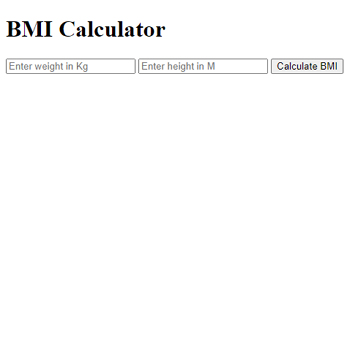

# London App Brewery - BMI Calculator

This is a solution to the [My First Server](https://www.udemy.com/course/the-complete-web-development-bootcamp/learn/lecture/12384620) challenge on [Udemy](https://www.udemy.com/course/the-complete-web-development-bootcamp/).

## Table of contents

- [Overview](#overview)
  - [The challenge](#the-challenge)
  - [Screenshot](#screenshot)
  - [Links](#links)
- [My process](#my-process)
  - [Built with](#built-with)
  - [How to install and run](#how-to-install-and-run)
- [Author](#author)

## Overview

### The challenge

"In this lesson, we're going to be building our very own interactive express server using Express and Node.js."

### Screenshot



### Links

- Code URL: [Github](https://github.com/cekstedt/LAB-BMI-Calculator)
- Live Site URL: [Render](https://bmi-calculator-d96q.onrender.com)
- Challenge URL: [Udemy](https://www.udemy.com/course/the-complete-web-development-bootcamp/learn/lecture/12384620)

## My process

### Built with

- NodeJS
- Express

### How to install and run

Make sure you have node.js installed.
```
node -v
```

Clone into the repo.
```
git clone https://github.com/cekstedt/LAB-BMI-Calculator.git
```

Navigate into the root project folder and install dependencies.
```
cd LAB-BMI-Calculator/
npm install
```

Run the command `npm run start` to start the server, then navigate to http://localhost:3000/ (when developing locally).


## Author

- [@cekstedt](https://github.com/cekstedt)